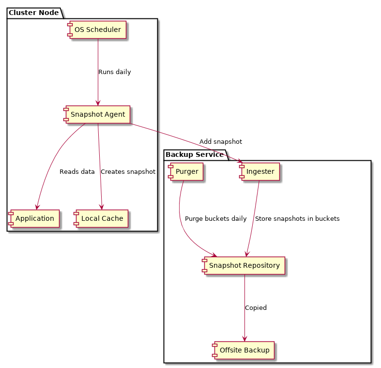

# Preconditions

BUYS design is based on a few assumptions about how it will be used.

## There is a Linux cluster with <100 nodes that run various applications

An application can be as simple as a django application using a sqlite database
on a single node, but also can be composed of multiple processes spanning
multiple nodes.

Each application is of small-to-medium scale, meaning the application runs on a
non-sharded database and user-generated content consumes hundreds of megabytes
or a few gigabytes, not exceeding 10 GB in size.

## All nodes are created using system automation software

In case of failure, the latest node configuration can be restored using system
automation software.  It is not important which tool is used, just the fact that
its possible to recreate the exact configuration at any time.  This avoids
resource-intensive system image snapshots.

## Application state (user-generated content) must be protected over time

Unlike node configuration, application state cannot be easily reproduced from
scratch.  It is also prone to data corruption and data loss, caused by user
mistakes, bugs in any layer of the stack (hardware, firmware, hypervisor,
operating system, application software), natural disasters, fire, theft, etc.

## Application state is stored in heterogenous formats

Applications often use a (relational) database management system to store
application state. Database management systems usually employ a custom internal
storage format on disk.  Including such files directly in a snapshot can cause
a corrupt dump file and problems during restore, because without coordination
from the database management system, the filesystem can not know which parts can
be copied safely, which data is temporary, not yet comitted, etc.  It would also
tie the dump file to a very specific database software version.

## Application software will evolve over time

A snapshot from the past might have been created using a different (older)
application version from what is running when the snapshot should be restored.

Without support from the application, a snapshot can only be used by the
application version it was created with.

# Non-goals

System backup is a complex topic, and there are often multiple right solutions.

This section collects functionality BYSU does not include (for now).

## Incremental snapshots

Apart from full snapshots, there are also incremental snapshots.  For now, BYSU
avoids incremental snapshots for the following reasons:

1. They are a solution to a problem which the intended environment does not have,
namely to make resource-intenstive backups of large datasets more efficient.
2. Implementing incremental backups would increase overall system complexity.
3. Even with incremental backups, there is still need for multiple backup
versions to isolate failures.

# Design

The simplest approach to protect small-to-medium scale applications is to make a
full snapshot of the application state once per day.

On each cluster node, a snapshot agent is installed with modules configured for
all applications that should be backed up.  The agent runs once per day, creates
snapshots, and stores them in a local cache on the node.  To protect snapshots
from corruption due to faulty nodes or attackers, the agent then sends them to
the backup service via restricted SSH.  Snapshots are only purged from the local
cache after they were successfully stored in the backup service.

## Snapshot agent

The snapshot agent is a small program installed on all cluster nodes.  It has a
config file at `/etc/bysu/agent.conf` that contains connection details of the
backup service and a list of snapshot templates.

Connection details include hostname, username, and path to the local private key
to allow adding snapshots.  A snapshot template is added for each application
and includes an application name, version and a set of datasource
configurations:

- `localfs`: a directory on the cluster node's filesystem
- `postgresql`: a PostgreSQL database schema
- `mysql`: a MySQL database schema

When the snapshot agents runs, for each snapshot, it

1. creates a directory in the local cache
2. extracts data from the datasources configured in each snapshot template
3. sends a tarball of the snapshot directory and metadata to the backup service
4. purges the local snapshot directory after the snapshot was added successfully

A single failed snapshot does not affect other snapshots from being created and
sent to the backup service.

The snapshot agent writes information to syslog.  Reporting/Alerting is out of
scope for BYSU but can be achieved using external centralized logging systems.

### Datasources

A datasource is an executable program and accepts one parameter with the
datasource configuration, e.g. a filesystem path or a database url.  The
datasource encapsulates low-level details of how the data is obtained.  It
should create a consistent snapshot of the data and write it to `stdout`, e.g.
using the export/import tools provided by the database vendor or using tar to
snapshot file trees with binary data.

## Backup Service

The snapshot agent sends snapshots to the backup service via SSH and public key
authentication. The backup service must only allow one command to add a new
snapshot with the given metadata:

     add-snapshot \
        --application=application-name \
        --instance=instance-name \
        --version=1.2.3.4 \
        --sha256=8f434346648f6b96df89dda901c5176b10a6d83961dd3c1ac88b59b2dc327aa4

The tarball must be sent to the command's `stdin`:

    tar -cf - /path/to/snapshot/directory | ssh backupservice \
        "add-snapshot --instance=app01 --application=application --version=1.2.3.4 \
        --sha256=8f434346648f6b96df89dda901c5176b10a6d83961dd3c1ac88b59b2dc327aa4"

The command will exit with -10 when the snapshot already exists in the
repository (based on the given sha256 checksum).

The backup service can decide to ignore snapshots with checksums already stored
in the repository.

When a new snapshot enters the service, it is determined in which bucket it must
be stored:

- `daily`: every snapshot
- `weekly`: snapshots on the last day of the week
- `monthly`: snapshots on the last day of the month
- `yearly`: snapshots on the last day of the year

Each bucket has a different retention policy:

- `daily`: snapshots of the last 7 days
- `weekly`: snapshots of the last 4 weeks
- `monthly`: snapshots of the last 12 months
- `yearly`: snapshots kept forever

All snapshots can be further replicated to another off-site host or copied to
tapes, but this is out of scope for BYSU.

### Snapshot data

In the repository, a snapshot is represented by two files: a descriptor file and
a tarball.  Descriptor files must end with `.snapshot` and store snapshot
metadata as key/value pairs, with one kv-pair per line.  No duplicate keys are
allowed.

    timestamp=[ISO-8601 UTC date]

Timestamp when the snapshot was created, to avoid using filesystem metadata for
ordering snapshots.  Filesystem metadata often accidentally changes and BYUS
should be a bit more robust in this case.  Millisecond precision is not
required here.

    tarball=backup-1234823.tar

Name of the tarball this snapshot references.  Must be in the same directory as
the descriptor file.

    sha256=checksum

SHA256 checksum for the tarball.

    application=text

Used together with `timestamp` to group and sort many snapshots.

    instance=text

Used together with `timestamp` to group and sort many snapshots.

    version=text

Intended to help the system administrator to make the right decision when
restoring a snapshot.
